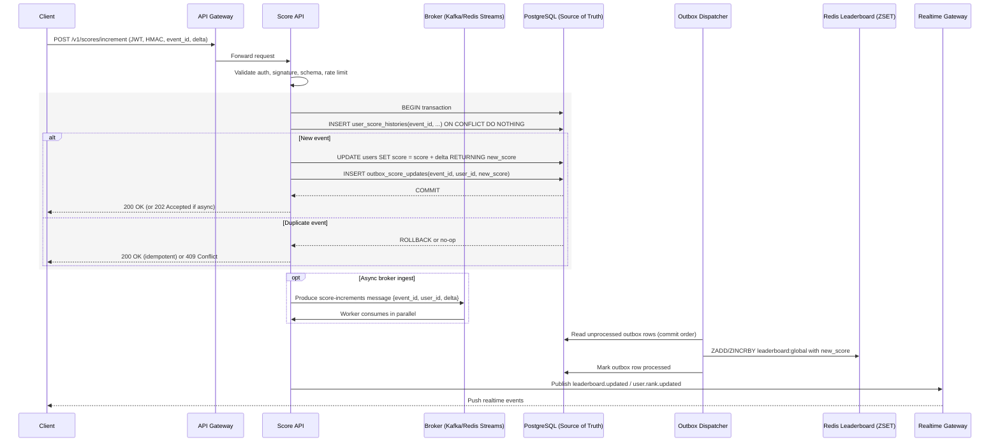

## Objectives

- Real-time top-10 scoreboard with sub-second updates.
- Secure score increments (auth + request signing) to prevent abuse.
- Idempotent updates under retries and clear observability.

## Scope

- In scope: increment API, top-10 and me endpoints, realtime via WebSocket/SSE, basic rate limiting and replay protection.
- Out of scope: client UI, action business logic, full identity lifecycle, multi-region DR details.
- Non-goals: advanced anti-cheat/ML, multiple seasonal/segmented leaderboards (initial phase).

## High-level Architecture

- Components: API service, Realtime gateway, Redis ZSET for leaderboard, durable DB for scores/events, optional message broker.
- Flow: client completes action → calls increment API with user_id/delta/event_id/signature → validate auth/signature + rate limit + idempotency → atomic `ZINCRBY` in Redis → broadcast if top-10 or caller rank changes → persist to DB (async).
- Realtime: broadcast with throttle/coalescing; fallback to short polling if realtime unavailable.
- Reliability: deduplicate by `event_id` with TTL; retries do not double-increment.

## API Interface

- Auth: Bearer JWT on all endpoints. Optional HMAC request signature for increment. Rate limits apply.

- POST `/v1/scores/increment`
  - Body: `{ "user_id": "string", "delta": number>0, "event_id": "uuid", "timestamp": "iso8601", "signature": "string" }`
  - Response 200: `{ "user_id": "u1", "new_score": 123, "rank": 7, "processed_event_id": "..." }`
  - Errors: 400 (validation), 401/403 (auth), 409 (duplicate event_id), 429 (rate limit)

- GET `/v1/leaderboard/top?limit=10`
  - Query: `limit` (1–20, default 10)
  - Response 200:
    `{ "entries": [{ "rank": 1, "user_id": "uX", "score": 999 }], "updated_at": "iso8601" }`

- GET `/v1/leaderboard/me`
  - Response 200: `{ "user_id": "u1", "score": 123, "rank": 7 }`

- GET `/v1/realtime/token` (optional if WS/SSE requires signed join)
  - Response 200: `{ "token": "...", "expires_at": "iso8601" }`

- WebSocket/SSE `/v1/realtime/leaderboard`
  - Events:
    - `leaderboard.updated`: `{ "top": [{ "rank": 1, "user_id": "uX", "score": 999 }], "ts": "iso8601" }`
    - `user.rank.updated`: `{ "user_id": "u1", "score": 123, "rank": 7, "ts": "iso8601" }`

- Security notes (concise):
  - Signature (optional but recommended): `HMAC-SHA256(secret, user_id|delta|event_id|timestamp)`; reject if timestamp skew > 60s.
  - Idempotency: deduplicate by `event_id` with TTL ≥ 24h; safe retries return 200 with same `processed_event_id`.

## Score Update Flow (Broker-based, ≥10k req/s)

- Mode: async ingest; API returns 202 Accepted after enqueue (or 200 if processed inline). Clients observe changes via realtime or subsequent GETs.

- Steps:
  1. Receive request → validate JWT/signature, schema, rate limit.
  2. Idempotency check: if DONE → 200; if PENDING → 202; else mark PENDING and enqueue.
  3. Produce message `{ event_id, user_id, delta, ts, source }` to broker.
  4. Consumers perform atomic `ZINCRBY`, compute rank if needed, mark DONE, publish realtime, batch-persist to DB.

- Broker options:
  - Kafka: topic `score-increments.v1`, key = `user_id` (per-user ordering), 16–32 partitions, compression `lz4|zstd`, `linger.ms=5–20ms`, `acks=1` (or `all` if stricter durability).
  - Redis Streams: stream `score:increments`; shard `N` streams by `hash(user_id)%N`, consumer groups for parallelism and ordering per user.

- Throughput targets (≥10k req/s):
  - 8–16 consumers at ~1k–2k msgs/s each; Redis pipelining and connection pooling.
  - Batch DB writes (100–500 events) to amortize I/O; coalesce realtime broadcasts to 100–300 ms windows.

- Guarantees & backpressure:
  - At-least-once with idempotent consumer keyed by `event_id` (no double increments).
  - Per-user ordering via partition/shard by `user_id`.
  - If lag rises, prefer 202 responses and throttle broadcast frequency; expose consumer lag metrics and alerts.

- Failure handling:
  - Dead-letter topic/stream for poison messages; bounded retries with exponential backoff.
  - Health checks on producers/consumers; autoscale workers by lag and CPU.

## Realtime Updates

- Transport: WebSocket preferred; SSE as fallback. Heartbeats every 30s (ping/pong or comment for SSE). Reconnect with exponential backoff + jitter.
- Auth & join: Bearer JWT or ephemeral realtime token from `/v1/realtime/token`. Join channel `leaderboard:global` and optional `user:{user_id}`.
- Event model: send full top-10 snapshot on connect, then `leaderboard.updated` when top-10 membership/order changes; `user.rank.updated` for caller’s own changes.
- Broadcast policy: coalesce updates in 100–300 ms windows; drop superseded snapshots and send only the latest within a window.
- Ordering & recovery: include monotonically increasing `version` and `ts`; clients ignore older versions and call `/v1/leaderboard/top` if a version gap is detected.
- Scale-out: gateway nodes subscribe to internal pub/sub (Redis Pub/Sub or Kafka) channel `lb.global`; keep a cached latest snapshot to serve new subscribers instantly.
- Limits & backpressure: cap events per client (e.g., 10/s), rate-limit joins, and disconnect slow consumers to protect the system. Fallback to 1–3s polling on degrade.

## Consistency & Performance (PostgreSQL as source of truth)

- Goal: all score changes are durably and atomically recorded in PostgreSQL; Redis ZSET is a cache/derivative updated only after a successful DB commit.

- Transactional update (single user increment):
  - Isolation: `READ COMMITTED` with row-level locks is sufficient; use `SERIALIZABLE` only if cross-row invariants are introduced.
  - Within one SQL transaction:
    1. Lock user row: `SELECT score FROM users WHERE user_id = $1 FOR UPDATE`.
    2. Idempotency guard: `INSERT INTO user_score_histories(event_id, user_id, delta, ts) VALUES(...) ON CONFLICT(event_id) DO NOTHING` and check `ROW_COUNT`.
       - If conflict → treat as already processed; return existing final score.
    3. Update score: `UPDATE users SET score = score + $2, updated_at = NOW() WHERE user_id = $1 RETURNING score`.
    4. Optionally update the history row with `previous_score`/`new_score` in the same transaction.
    5. Insert outbox record: `INSERT INTO outbox_score_updates(event_id, user_id, new_score, ts) VALUES(...)`.
    6. Commit. If any step fails → rollback and return error.

- Dual-write avoidance (Redis after commit):
  - Use the outbox table to asynchronously propagate the committed change to Redis ZSET (`leaderboard:global`).
  - A dispatcher reads outbox rows in commit order and executes `ZADD` with the new absolute score (or `ZINCRBY delta` if you prefer), then marks the outbox row processed.
  - If Redis is unavailable, outbox retries ensure eventual cache consistency while DB remains correct.

- Schema & constraints (minimal):
  - `users(user_id PK, score BIGINT NOT NULL DEFAULT 0, updated_at TIMESTAMPTZ, ...)`
  - `user_score_histories(event_id UUID PK, user_id FK, delta BIGINT NOT NULL, ts TIMESTAMPTZ NOT NULL, previous_score BIGINT NULL, new_score BIGINT NULL)`
  - `outbox_score_updates(id BIGSERIAL PK, event_id UUID UNIQUE, user_id, new_score BIGINT, ts TIMESTAMPTZ, processed_at TIMESTAMPTZ NULL)`
  - Indexes: `user_score_histories(user_id, ts DESC)`, `outbox_score_updates(processed_at NULLS FIRST)`

- Consumer strategy (≥10k req/s):
  - Partition Kafka by `user_id` or shard Redis Streams; run N DB writer workers, each with a bounded transaction pool and `SKIP LOCKED` when scanning outbox.
  - Batch outbox dispatch in groups of 100–500 to amortize Redis round trips (use pipelining).

- Failure semantics:
  - If DB tx fails → return 4xx/5xx; nothing changes in Redis.
  - If Redis update fails after commit → outbox retry continues until success; realtime can still read from Redis when it catches up.
  - Idempotency is enforced at DB via unique `event_id`; repeating events do not change state.

## Anti-fraud

- Signature/HMAC with a short validity window (≤60s).
- Anomaly checks: oversized delta, excessive frequency, unusual geolocation.

## Error Handling & Retry

- Client errors: 400 (validation/signature), 401/403 (auth), 409 (duplicate event_id), 429 (rate limit). Include `error_code`, `message`, and `event_id` (if present).
- Server errors: 5xx are retryable; clients use exponential backoff (100–500 ms base, jitter). Idempotency ensures safe retries.
- Broker consumer: bounded retries with exponential backoff; dead-letter on exhaustion; alert on DLQ growth.
- Realtime: if connection drops or rate-limited, fallback to 1–3 s polling; ignore out-of-order events by `version`.
- Consistency on failure: if DB tx fails → no Redis change; outbox retries ensure Redis eventually reflects DB after commit.

## Deployment & Scalability

- Stateless API containers; horizontal scale behind load balancer; readiness/liveness probes.
- PostgreSQL: pgbouncer, tuned autovacuum, appropriate indexes, partition `user_score_histories` by time if large.
- Redis: cluster or primary-replica; enable pipelining and connection pooling; monitor memory/evictions.
- Broker: Kafka partitions (16–32) or Redis Streams sharding by `user_id`; autoscale consumers by lag.
- CI/CD: blue-green or canary deployments; feature flags to toggle realtime/broker paths.
- Observability: metrics (QPS, p95/99 latency, error rates, consumer lag), structured logs, distributed tracing.
- Security: secret rotation, TLS everywhere, network isolation (private subnets), rate limiting at edge.

## Acceptance Criteria

- Realtime: top-10 reflects updates within ≤1s p95; no duplicate increments for the same `event_id`.
- Throughput: sustain ≥10k increment req/s for ≥15 minutes with <1% errors and p95 API latency ≤200 ms.
- Consistency: DB is the source of truth; Redis reflects committed scores within ≤2s p95 via outbox.
- API correctness: `/top` returns correct top N; `/me` returns accurate score and rank.
- Security: signatures with ≤60s skew are required (if enabled); replay attempts are rejected; rate limits enforced.
- Observability: dashboards, alerts on error rate/lag, and audit trail via `user_score_histories`.

## Future Improvements

- Multiple leaderboards (seasonal, regional, per-segment) and pagination around a user’s rank.
- Friend/relative leaderboards and privacy controls.
- Advanced anti-cheat: device attestation, proof-of-work, anomaly ML.
- Protocols: WebTransport/HTTP3, delta events to reduce payloads, ETag support for `/top`.
- Admin tooling: event reversal, user bans, and manual score adjustments with audit.
- Developer ergonomics: OpenAPI spec and SDKs; chaos testing and load testing automation.

## Flow Diagram

